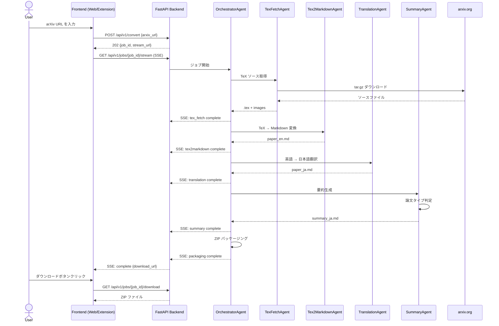

# arXiv Translator 仕様書

## 1. システム概要

arXiv Translator は、arXiv 論文の URL を入力として受け取り、TeX ソースを取得し、Markdown に変換（画像、脚注、引用、著者所属、数式を保持）、日本語に翻訳し、要約を生成するサービスです。出力はすべての成果物を含む ZIP ファイルとして提供されます。

## 2. アーキテクチャ

### 2.1 フロントエンド

- **Web UI**: React 18 + TypeScript + Vite
- **Chrome 拡張機能**: Manifest V3（arxiv.org 対応）

### 2.2 バックエンド

- **言語/フレームワーク**: Python 3.12+ / FastAPI
- **AI エージェント**: Google ADK (Agent Development Kit)
- **LLM**: Gemini

### 2.3 インフラストラクチャ (AWS)

- **コンピューティング**: ECS Fargate
- **CDN / 静的ホスティング**: CloudFront + S3
- **ロードバランサー**: ALB（API Gateway は SSE の 29 秒制限のため不採用）
- **認証**: Cognito
- **データベース**: 不要（ジョブはインメモリ管理）

## 3. API エンドポイント

### 3.1 POST /api/v1/convert

arXiv 論文の変換ジョブを作成します。

**リクエスト:**

```json
{
  "arxiv_url": "https://arxiv.org/abs/2401.12345"
}
```

**レスポンス (202 Accepted):**

```json
{
  "job_id": "uuid-string",
  "stream_url": "/api/v1/jobs/{job_id}/stream"
}
```

### 3.2 GET /api/v1/jobs/{job_id}/stream

SSE (Server-Sent Events) による進捗イベントのストリーミング。

**イベントフロー:**

```
tex_fetch → tex2markdown → translation → summary → packaging → complete
```

**イベント形式:**

```
event: progress
data: {"stage": "tex_fetch", "status": "running", "progress": 0.3, "message": "TeXソースをダウンロード中..."}

event: progress
data: {"stage": "complete", "status": "done", "progress": 1.0, "download_url": "/api/v1/jobs/{job_id}/download"}
```

### 3.3 GET /api/v1/jobs/{job_id}/download

変換結果の ZIP ファイルをダウンロードします。

**レスポンス:** `application/zip`

### 3.4 GET /api/v1/health

ヘルスチェックエンドポイント。

**レスポンス:**

```json
{
  "status": "healthy",
  "version": "0.1.0"
}
```

## 4. エージェントパイプライン

Google ADK を使用し、すべてのエージェントは AgentTool として実装されます。

### 4.1 OrchestratorAgent

パイプライン全体を制御するシーケンシャルコントローラー。各エージェントを順次呼び出し、進捗状況を SSE 経由で報告します。

### 4.2 TexFetchAgent

- arXiv から tar.gz ソースファイルをダウンロード
- アーカイブを展開し、`.tex` ファイルと画像ファイルを抽出

### 4.3 Tex2MarkdownAgent

- LLM を使用して TeX を Markdown に変換
- 以下の構造を保持:
  - 画像参照
  - 脚注
  - 引用 (citations)
  - 著者所属情報
  - 数式（LaTeX 形式を維持）

### 4.4 TranslationAgent

- LLM を使用して英語 Markdown を日本語に翻訳
- Markdown 構造を維持したまま翻訳
- 技術用語の適切な翻訳

### 4.5 SummaryAgent

論文タイプに基づいて適切な要約テンプレートを選択します。

**ステップ 1: 論文タイプの分類**

SummaryAgent はまず論文の内容から論文タイプを判定します:

- **通常論文 (Regular Paper)**
- **レビュー/サーベイ論文 (Review/Survey Paper)**

**ステップ 2: テンプレート選択**

#### 通常論文テンプレート (summary_template.md)

| セクション | 説明 |
|---|---|
| 要約 | 論文の概要 |
| 使用された手法 | 提案手法の詳細 |
| 技術の主要なポイント | 重要な技術的貢献 |
| 先行研究との比較 | 既存手法との違い |
| 実験方法 | 実験設定と結果 |
| 議論 | 考察と今後の課題 |

#### レビュー/サーベイ論文テンプレート (summary_review_template.md)

| セクション | 説明 |
|---|---|
| 要約 | サーベイの概要 |
| レビュー/サーベイ項目 | 調査対象の分類と整理 |
| 比較 | 手法間の比較分析 |
| 議論 | 研究動向と今後の展望 |

## 5. ZIP 出力構成

```
output.zip
├── paper_en.md          # 英語 Markdown
├── paper_ja.md          # 日本語翻訳 Markdown
├── summary_ja.md        # 日本語要約
└── images/              # 論文内の画像ファイル
    ├── figure1.png
    ├── figure2.png
    └── ...
```

## 6. ディレクトリ構造

```
ArxivSummaryChromeExtension/
├── docs/
│   └── SPEC.md
├── backend/
│   ├── pyproject.toml
│   ├── .env.example
│   ├── src/
│   │   ├── __init__.py
│   │   ├── main.py
│   │   ├── config.py
│   │   ├── api/
│   │   │   ├── __init__.py
│   │   │   ├── routes.py
│   │   │   └── auth.py
│   │   ├── agents/
│   │   │   ├── __init__.py
│   │   │   ├── orchestrator.py
│   │   │   ├── tex_fetch.py
│   │   │   ├── tex2markdown.py
│   │   │   ├── translation.py
│   │   │   └── summary.py
│   │   ├── tools/
│   │   │   ├── __init__.py
│   │   │   ├── arxiv.py
│   │   │   └── packaging.py
│   │   └── services/
│   │       ├── __init__.py
│   │       ├── job_manager.py
│   │       └── sse.py
│   └── tests/
│       ├── __init__.py
│       ├── conftest.py
│       ├── test_agents/
│       │   ├── __init__.py
│       │   ├── test_tex_fetch.py
│       │   ├── test_tex2markdown.py
│       │   ├── test_translation.py
│       │   └── test_summary.py
│       ├── test_api/
│       │   ├── __init__.py
│       │   └── test_routes.py
│       └── eval/
│           ├── __init__.py
│           ├── eval_tex2markdown.py
│           ├── eval_translation.py
│           └── eval_summary.py
├── frontend/
│   ├── web/
│   │   ├── package.json
│   │   ├── vite.config.ts
│   │   ├── tsconfig.json
│   │   ├── index.html
│   │   └── src/
│   │       ├── App.tsx
│   │       ├── main.tsx
│   │       ├── components/
│   │       │   ├── UrlInput.tsx
│   │       │   ├── ProgressView.tsx
│   │       │   └── DownloadButton.tsx
│   │       ├── hooks/
│   │       │   └── useSSE.ts
│   │       └── services/
│   │           ├── api.ts
│   │           └── auth.ts
│   └── chrome-extension/
│       ├── manifest.json
│       ├── popup/
│       │   ├── popup.html
│       │   ├── popup.tsx
│       │   └── popup.css
│       ├── content/
│       │   └── content.ts
│       └── background/
│           └── service-worker.ts
├── infrastructure/
│   └── README.md
├── .gitignore
├── .env.example
└── README.md
```

## 7. シーケンス図



## 8. Chrome 拡張機能の動作

### 8.1 概要

Chrome 拡張機能は arxiv.org のページにコンテンツスクリプトを注入し、論文ページに「翻訳」ボタンを追加します。

### 8.2 動作フロー

1. ユーザーが arxiv.org の論文ページ（`arxiv.org/abs/*`）にアクセス
2. コンテンツスクリプトがページに「翻訳・要約」ボタンを挿入
3. ボタンクリックで拡張機能のポップアップが開き、現在の論文 URL が自動入力される
4. ユーザーが変換を開始すると、バックエンド API に変換リクエストを送信
5. SSE で進捗状況をポップアップ内に表示
6. 完了後、ZIP ファイルのダウンロードリンクを表示

### 8.3 権限

- `activeTab`: 現在のタブの URL を取得
- `storage`: 設定の保存
- ホスト権限: `https://arxiv.org/*`, バックエンド API の URL

## 9. 環境変数

```env
# LLM
GOOGLE_API_KEY=your-google-api-key
LLM_MODEL=gemini-2.0-flash

# AWS
AWS_REGION=ap-northeast-1
COGNITO_USER_POOL_ID=ap-northeast-1_xxxxxxxxx
COGNITO_APP_CLIENT_ID=xxxxxxxxxxxxxxxxxxxxxxxxxx
S3_BUCKET_NAME=arxiv-translator-output

# App
APP_ENV=development
LOG_LEVEL=INFO
CORS_ORIGINS=http://localhost:5173
```

## 10. 非機能要件

### 10.1 パフォーマンス

- 論文1本あたりの処理時間: 目標 3 分以内
- SSE によるリアルタイム進捗表示で体感待ち時間を軽減

### 10.2 スケーラビリティ

- ECS Fargate によるオートスケーリング
- ステートレス設計（ジョブ状態はインメモリ、永続化不要）

### 10.3 セキュリティ

- Cognito による認証
- CORS 設定による API アクセス制御
- 環境変数による秘密情報管理
- HTTPS 必須

### 10.4 可用性

- ヘルスチェックエンドポイントによる監視
- ALB による負荷分散
- CloudFront による静的アセット配信

### 10.5 保守性

- Google ADK によるエージェントの疎結合設計
- 各エージェントの独立したテストとリアルタイムな評価 (eval)
- 型安全な TypeScript フロントエンド
