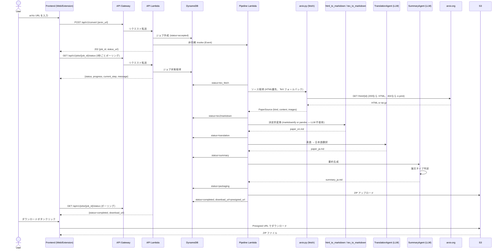

# arXiv Translator 仕様書

## 1. システム概要

arXiv Translator は、arXiv 論文の URL を入力として受け取り、TeX ソースを取得し、Markdown に変換（画像、脚注、引用、著者所属、数式を保持）、日本語に翻訳し、要約を生成するサービスです。出力はすべての成果物を含む ZIP ファイルとして提供されます。

## 2. アーキテクチャ

### 2.1 フロントエンド

- **Web UI**: React 18 + TypeScript + Vite
- **Chrome 拡張機能**: Manifest V3（arxiv.org 対応）

### 2.2 バックエンド

- **言語/フレームワーク**: Python 3.12+ / FastAPI (Mangum 経由で Lambda 上で実行)
- **AI エージェント**: Google ADK (Agent Development Kit)
- **LLM**: Gemini

### 2.3 インフラストラクチャ (AWS)

- **コンピューティング**: Lambda (API ハンドラー + パイプライン実行)
- **API ゲートウェイ**: HTTP API (API Gateway v2)
- **CDN / 静的ホスティング**: CloudFront + S3
- **認証**: Cognito
- **ジョブ状態管理**: DynamoDB (TTL による自動クリーンアップ)
- **一時ファイルストレージ**: S3 (ZIP 出力、1時間 TTL)

## 3. API エンドポイント

### 3.1 POST /api/v1/convert

arXiv 論文の変換ジョブを作成します。

**リクエスト:**

```json
{
  "arxiv_url": "https://arxiv.org/abs/2401.12345"
}
```

**レスポンス (202 Accepted):**

```json
{
  "job_id": "uuid-string",
  "status": "accepted",
  "status_url": "/api/v1/jobs/{job_id}/status"
}
```

### 3.2 GET /api/v1/jobs/{job_id}/status

ジョブの進捗状況をポーリングで取得します。フロントエンドは 3 秒間隔でこのエンドポイントをポーリングし、進捗を表示します。

**レスポンス:**

```json
{
  "job_id": "uuid-string",
  "status": "translation",
  "current_step": "translation",
  "progress": 60,
  "message": "日本語翻訳中...",
  "error": null,
  "download_url": null
}
```

**完了時:**

```json
{
  "job_id": "uuid-string",
  "status": "completed",
  "current_step": "done",
  "progress": 100,
  "message": "処理が完了しました",
  "error": null,
  "download_url": "https://s3.amazonaws.com/..."
}
```

**ステータス遷移:**

```
accepted → tex_fetch → tex2markdown → translation → summary → packaging → completed
                                                                              or error
```

### 3.3 GET /api/v1/health

ヘルスチェックエンドポイント。

**レスポンス:**

```json
{
  "status": "healthy",
  "version": "0.1.0"
}
```

## 4. パイプライン構成

LLM (Google ADK) は **翻訳** と **要約** の 2 ステージだけで使用します。
その他のステージは決定的なライブラリ変換 / I/O 処理です。

### 4.1 オーケストレーター (`agents/orchestrator.py`)

パイプライン全体を制御する線形 async 関数 `run_pipeline()`。各ステージ間で
DynamoDB に進捗を書き込みます。ADK の `SequentialAgent` は使いません
(進捗書き込みを挟めない、かつ半分のステージが LLM ではないため)。

### 4.2 ソース取得 (`tools/arxiv.py`, 非 LLM)

- HTML 優先: `arxiv.org/html/<id>` が 200 なら HTML を使用
- TeX フォールバック: e-print の tar.gz を取得し、`\input` / `\include` を
  再帰展開して単一文書に統合
- PDF のみの論文は `PdfOnlyPaperError` で明示エラー

### 4.3 ソース → Markdown 変換 (決定的)

**LLM を使わない決定的変換**で行います。論文の取得形式に応じて 2 経路:

- **HTML 経路** (`tools/html_to_markdown.py`): `arxiv.org/html/<id>` が利用可能な
  場合に優先。`markdownify` で HTML → Markdown 変換。
  `<math alttext="...">` の元 LaTeX を ``$...$`` / ``$$...$$`` に復元、
  `<article class="ltx_document">` セレクタで本文だけを切り出す。
- **TeX 経路** (`tools/tex_to_markdown.py`): HTML が無い場合は e-print の TeX
  を取得し、`\input` / `\include` を再帰展開した単一文書を `pandoc` で
  Markdown に変換。

両方とも構造（見出し・箇条書き・表）、画像参照、数式 (``$...$``)、引用を保持。
LLM 呼び出しがゼロなのでコスト・レイテンシ・安定性が向上。
PDF のみの論文 (`\includepdf` ラッパー含む) は `PdfOnlyPaperError` で
分かるエラーを返します。

### 4.4 TranslationAgent

- LLM を使用して英語 Markdown を日本語に翻訳
- Markdown 構造を維持したまま翻訳
- 技術用語の適切な翻訳

### 4.5 SummaryAgent

論文タイプに基づいて適切な要約テンプレートを選択します。

**ステップ 1: 論文タイプの分類**

SummaryAgent はまず論文の内容から論文タイプを判定します:

- **通常論文 (Regular Paper)**
- **レビュー/サーベイ論文 (Review/Survey Paper)**

**ステップ 2: テンプレート選択**

#### 通常論文テンプレート (summary_template.md)

| セクション | 説明 |
|---|---|
| 要約 | 論文の概要 |
| 使用された手法 | 提案手法の詳細 |
| 技術の主要なポイント | 重要な技術的貢献 |
| 先行研究との比較 | 既存手法との違い |
| 実験方法 | 実験設定と結果 |
| 議論 | 考察と今後の課題 |

#### レビュー/サーベイ論文テンプレート (summary_review_template.md)

| セクション | 説明 |
|---|---|
| 要約 | サーベイの概要 |
| レビュー/サーベイ項目 | 調査対象の分類と整理 |
| 比較 | 手法間の比較分析 |
| 議論 | 研究動向と今後の展望 |

## 5. ZIP 出力構成

```
output.zip
├── paper_en.md          # 英語 Markdown
├── paper_ja.md          # 日本語翻訳 Markdown
├── summary_ja.md        # 日本語要約
└── images/              # 論文内の画像ファイル
    ├── figure1.png
    ├── figure2.png
    └── ...
```

## 6. ディレクトリ構造

```
ArxivSummaryChromeExtension/
├── docs/
│   └── SPEC.md
├── backend/
│   ├── pyproject.toml
│   ├── .env.example
│   ├── src/
│   │   ├── __init__.py
│   │   ├── main.py                  # FastAPI app + Mangum Lambda handler
│   │   ├── pipeline_handler.py      # Pipeline Lambda handler
│   │   ├── config.py
│   │   ├── api/
│   │   │   ├── __init__.py
│   │   │   ├── routes.py
│   │   │   └── auth.py
│   │   ├── agents/                  # LLM-driven stages only
│   │   │   ├── __init__.py
│   │   │   ├── orchestrator.py
│   │   │   ├── translation.py
│   │   │   └── summary.py
│   │   ├── tools/                   # I/O + deterministic transforms
│   │   │   ├── __init__.py
│   │   │   ├── arxiv.py             # fetch + TeX extraction + PDF detection
│   │   │   ├── html_to_markdown.py  # markdownify-based (arxiv.org/html)
│   │   │   ├── tex_to_markdown.py   # pandoc-based (e-print TeX)
│   │   │   └── packaging.py
│   │   └── services/
│   │       ├── __init__.py
│   │       ├── job_manager.py       # DynamoDB-backed job state
│   │       └── pipeline_dispatcher.py  # prod (Lambda) vs dev (asyncio)
│   └── tests/
│       ├── __init__.py
│       ├── conftest.py
│       ├── test_agents/
│       │   ├── __init__.py
│       │   ├── test_tex_fetch.py
│       │   ├── test_translation.py
│       │   └── test_summary.py
│       ├── test_tools/
│       │   ├── __init__.py
│       │   └── test_tex_to_markdown.py
│       ├── test_api/
│       │   ├── __init__.py
│       │   └── test_routes.py
│       └── eval/                    # LLM-stage evals only
│           ├── __init__.py
│           ├── eval_translation.py
│           └── eval_summary.py
├── frontend/
│   ├── web/
│   │   ├── package.json
│   │   ├── vite.config.ts
│   │   ├── tsconfig.json
│   │   ├── index.html
│   │   └── src/
│   │       ├── features/
│   │       │   ├── paper-convert/
│   │       │   └── job-status/
│   │       │       └── hooks/
│   │       │           └── useJobPolling.ts
│   │       ├── shared/
│   │       ├── pages/
│   │       └── app/
│   └── chrome-extension/
│       ├── manifest.json
│       ├── popup/
│       │   ├── popup.html
│       │   ├── popup.tsx
│       │   └── popup.css
│       ├── content/
│       │   └── content.ts
│       └── background/
│           └── service-worker.ts
├── infrastructure/
│   ├── deploy.sh
│   └── cdk/
│       ├── app.py
│       └── stacks/
│           ├── auth_stack.py
│           ├── backend_stack.py
│           └── storage_stack.py
├── .gitignore
├── .env.example
└── README.md
```

## 7. シーケンス図



## 8. Chrome 拡張機能の動作

### 8.1 概要

Chrome 拡張機能は arxiv.org のページにコンテンツスクリプトを注入し、論文ページに「翻訳」ボタンを追加します。

### 8.2 動作フロー

1. ユーザーが arxiv.org の論文ページ（`arxiv.org/abs/*`）にアクセス
2. コンテンツスクリプトがページに「翻訳・要約」ボタンを挿入
3. ボタンクリックで拡張機能のポップアップが開き、現在の論文 URL が自動入力される
4. ユーザーが変換を開始すると、バックエンド API に変換リクエストを送信
5. ポーリングで進捗状況をポップアップ内に表示
6. 完了後、S3 presigned URL 経由で ZIP ファイルをダウンロード

### 8.3 権限

- `activeTab`: 現在のタブの URL を取得
- `storage`: 設定の保存
- ホスト権限: `https://arxiv.org/*`, バックエンド API の URL

## 9. 環境変数

```env
# LLM
GOOGLE_API_KEY=your-google-api-key
LLM_MODEL=gemini-2.5-pro-preview-05-06

# AWS
AWS_REGION=ap-northeast-1
COGNITO_USER_POOL_ID=ap-northeast-1_xxxxxxxxx
COGNITO_APP_CLIENT_ID=xxxxxxxxxxxxxxxxxxxxxxxxxx
S3_BUCKET_NAME=arxiv-translator-output

# DynamoDB
DYNAMODB_TABLE_NAME=arxiv-translator-jobs
DYNAMODB_ENDPOINT_URL=             # ローカル開発時のみ設定

# Lambda
PIPELINE_LAMBDA_NAME=arxiv-translator-pipeline  # ローカル開発時は空

# App
APP_ENV=development
LOG_LEVEL=INFO
CORS_ORIGINS=http://localhost:5173
```

## 10. 非機能要件

### 10.1 パフォーマンス

- 論文1本あたりの処理時間: 目標 3 分以内
- ポーリング（3秒間隔）による進捗表示で体感待ち時間を軽減

### 10.2 スケーラビリティ

- Lambda による自動スケーリング（同時実行数で制御）
- DynamoDB のオンデマンドキャパシティで読み書きスケーリング

### 10.3 セキュリティ

- Cognito による認証
- CORS 設定による API アクセス制御
- 環境変数による秘密情報管理
- HTTPS 必須
- S3 presigned URL による時限付きダウンロード

### 10.4 コスト

- サーバーレス構成により、使用時のみ課金
- DynamoDB TTL による自動データ削除
- S3 ライフサイクルポリシーによる ZIP ファイルの自動削除
- 月額推定: 低利用時 $1 未満

### 10.5 保守性

- Google ADK によるエージェントの疎結合設計
- 各エージェントの独立したテストとリアルタイムな評価 (eval)
- 型安全な TypeScript フロントエンド
